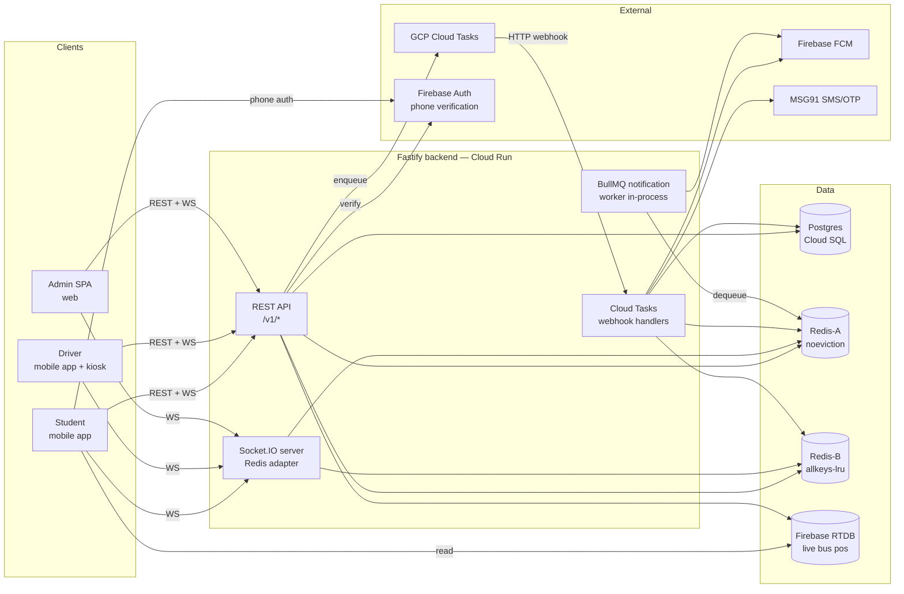
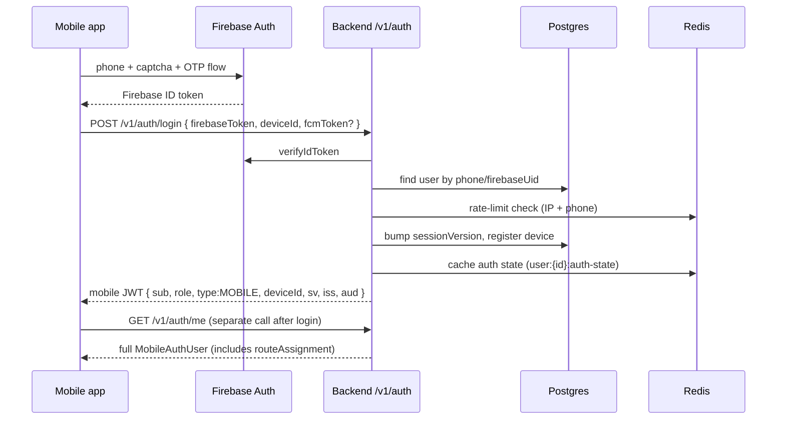
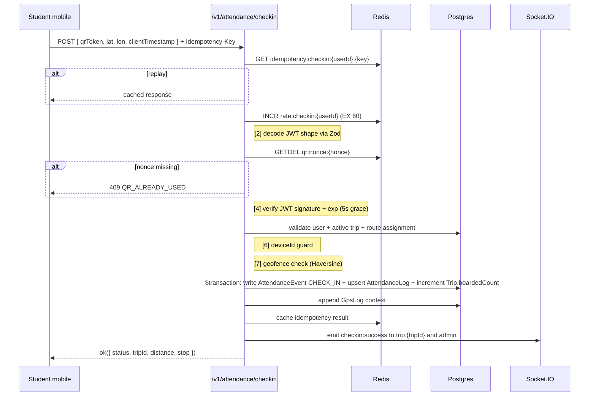
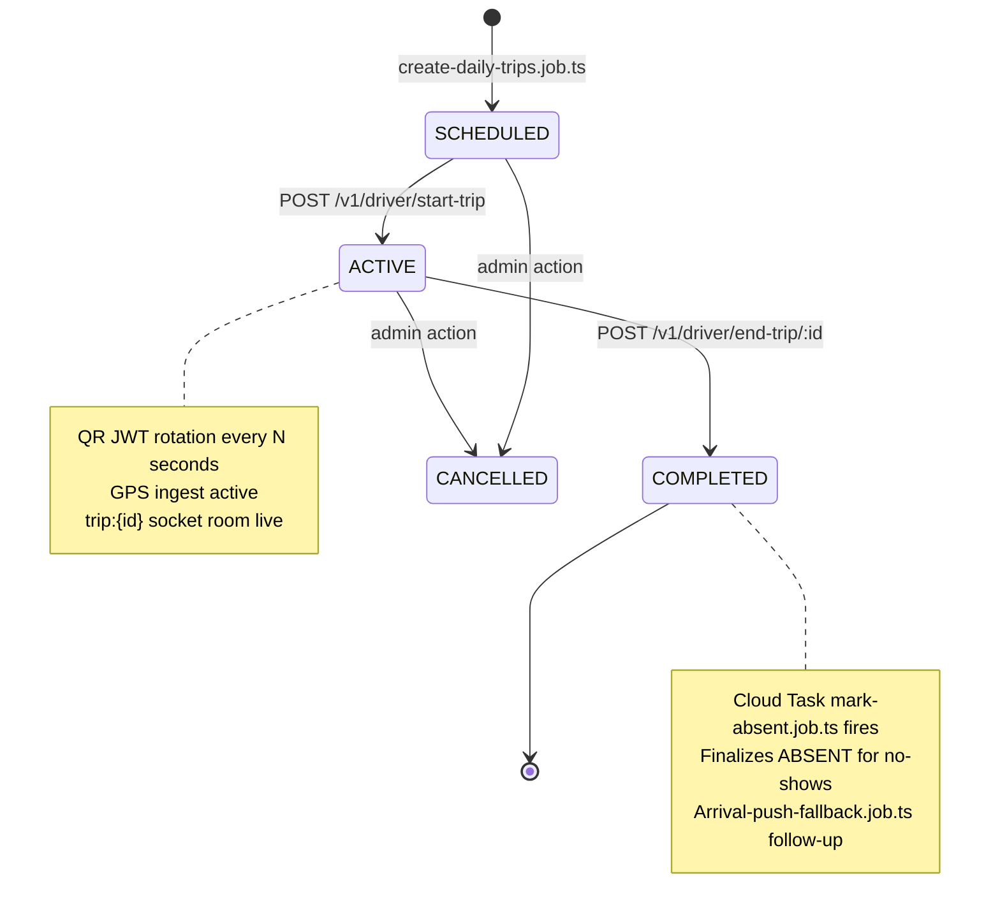
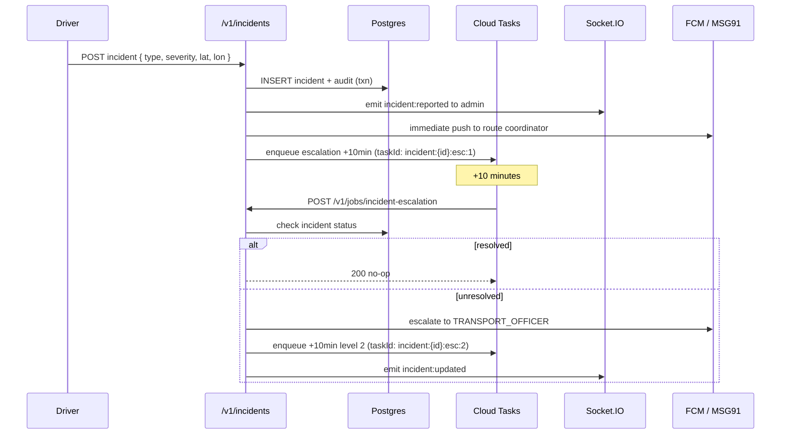
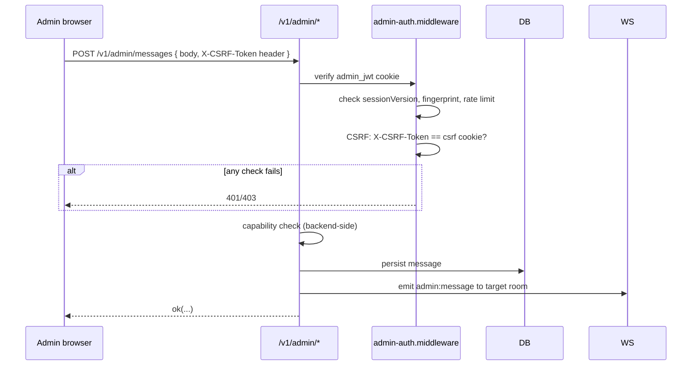

# Architecture — College Bus Management System

> **Scope.** The canonical architecture reference for this repo. Covers system context, components, storage, data flows for the critical paths, async job topology, security boundaries, deployment, and the phase-2 (university platform) roadmap.
>
> **Relationship to other docs.** [`CLAUDE.md`](../CLAUDE.md) owns the "rules and invariants" for agents. [`API_CONTRACT_MATRIX.md`](API_CONTRACT_MATRIX.md) owns the route inventory. [`SOCKET_EVENT_REGISTRY.md`](SOCKET_EVENT_REGISTRY.md) owns the socket inventory. This file explains *why* things are shaped the way they are and *how* they fit together.

---

## 1. System context



**Boundaries.** The backend is one deployed service. The only horizontal split is that the Socket.IO server and the HTTP API share the same Node process but use Redis to share rooms across Cloud Run instances. Jobs run in the same process as request handlers — Cloud Tasks delivers them via HTTP back to the same service.

---

## 2. Components

### 2.1 Backend (`apps/backend`)

Fastify 4 service. Entry at [`src/server.ts`](../apps/backend/src/server.ts):

1. Import [`src/app.ts`](../apps/backend/src/app.ts) — Zod env validation runs here; throws on invalid prod config.
2. Initialize the Redis `dashboard:stats` hash atomically via `EVAL` so only one instance on cold start seeds it.
3. On the leader (first instance to win the init race) run `reconcileRedis()` to heal drift.
4. Attach Socket.IO to the Fastify HTTP server with the Redis adapter.
5. Start `startDelegateMonitor()` — a short-lived in-process `setInterval` watchdog that ends stale delegation sessions (this is the *only* sanctioned in-process schedule; everything else is Cloud Tasks).
6. Listen on `HOST:PORT`.

Shutdown on `SIGTERM`/`SIGINT`: Fastify, sockets, notification worker, Prisma, Redis close in parallel. Failed close → `exit(1)`.

### 2.2 Admin SPA (`apps/admin`)

React 18 + Vite 5 + React Router v6 + TanStack Query + Zustand. Two shells:

- **`LiveOpsShell`** — live operational surfaces (dashboard, fleet map, trip detail, incidents, messages, ops center, GPS outages, audit log).
- **`AdminDataShell`** — data management (corrections, reports, students, routes, buses, drivers, security, admin users).

`AuthBootstrap` wrapper in [`App.tsx`](../apps/admin/src/App.tsx) calls `GET /v1/admin/auth/me` on load → hydrates store → routes based on capabilities. Every route is capability-gated with `<RequireCapability>`.

### 2.3 Mobile (`apps/mobile`)

Expo (~51) + React Native + Expo Router. Three route groups:

- `(auth)/` — login, OTP, pending.
- `(student)/` — home, map, scanner, check-in, history, correction, self-report, profile.
- `(driver)/` — today, kiosk, breakdown, post-breakdown, route-preview, summary, messages.

Foreground runtime uses Zustand + TanStack Query. Background runtime (driver GPS task) is a separate Expo TaskManager process — reads state from AsyncStorage, not memory. This matters: the foreground Zustand store is unreachable from the background runtime.

### 2.4 Shared (`packages/shared`)

Types, Zod schemas, constants, validators, policy, response helpers, Haversine math, IST time utilities. Imported as `shared` by all three apps. This is the contract layer.

---

## 3. Storage model

### 3.1 Postgres — system of record

35 Prisma models grouped into seven domains (identity/roles, fleet/routing, trips, attendance, telemetry, ops, onboarding, auditing). Schema is at [`apps/backend/src/db/prisma/schema.prisma`](../apps/backend/src/db/prisma/schema.prisma). Migrations via `prisma migrate`. Composite indexes on every hot query path.

**Event sourcing for attendance.** `AttendanceLog` holds current state; `AttendanceEvent` is an append-only audit trail. Corrections and excuses append new events; `AttendanceLog` is recomputed from the latest. Never mutate `AttendanceEvent`.

### 3.2 Redis — two logical roles

| Role | Eviction policy (prod) | Data |
|---|---|---|
| **Redis-A** — security-critical | `noeviction` | JWT nonces, QR nonces, idempotency records, distributed locks, admin session version, auth-state cache, `dashboard:stats` |
| **Redis-B** — ephemeral | `allkeys-lru` | Rate-limit counters, live GPS state (`bus:{id}:live`), dashboard-derived caches |

Redis A loss = correctness loss (double-scan becomes possible, idempotency replays break). Redis B loss = rate limits reset, live cache fills from DB on next read — the circuit breaker in [`redis-circuit.ts`](../apps/backend/src/lib/redis-circuit.ts) has explicit degraded-allow fallbacks.

Local dev: one Docker Redis on port 6380 handles both. Production: separate Memorystore instances.

### 3.3 Firebase Realtime Database — live position

The mobile map reads from `buses/{busId}` on Firebase RTDB. Writes come from [`gps.service.ts`](../apps/backend/src/modules/gps/gps.service.ts) on every GPS ping. This is a projection, not a system of record — Postgres `GpsLog` is. RTDB is chosen because broadcast-style reads are cheap and the map doesn't need history.

### 3.4 Retention

- `GpsLog` — 30 days (Cloud Task `gps-cleanup.job.ts` enforces this).
- `Notification`, `NotificationDrop` — no policy yet, will need one.
- `AuditLog`, `AuthAuditEvent` — kept indefinitely for now.
- Idempotency keys — short TTL in Redis (minutes to hours), by endpoint.

---

## 4. Critical data flows

### 4.1 Mobile login



**Key guarantees:**

- Token is bound to `deviceId`; replay from another device fails the `auth-cache` check.
- `sv` enforces logout-all — any request with a stale `sv` is rejected.
- Rate limits are enforced in the service layer (`mobile-auth.service.ts`), not the route.

### 4.2 QR check-in (the 13-step flow)



Every numbered step in [`attendance.service.ts`](../apps/backend/src/modules/attendance/attendance.service.ts) is commented. Nonce burning is atomic and is the double-scan defense. If the JWT verification fails *after* the nonce burn, the nonce stays burned — that's intentional; a malformed QR from a valid nonce shouldn't be retriable.

### 4.3 Trip lifecycle



**Daily bootstrap.** `create-daily-trips.job.ts` materializes one `Trip` row per active bus/route/tripType at a scheduled time via Cloud Tasks.

**Start trip.** Driver calls `POST /v1/driver/start-trip` → `Trip.status = ACTIVE`, socket emits `trip:started` to `admin` + `route:{routeId}`, QR rotation begins for the driver's kiosk socket.

**End trip.** `POST /v1/driver/end-trip/:tripId` → `Trip.status = COMPLETED`, emits `trip:ended`, enqueues `mark-absent` Cloud Task.

**Late start.** `late-start-alert.job.ts` is a Cloud Task scheduled at trip start + threshold; if trip still `SCHEDULED`, emits `trip:late-start` to admin.

### 4.4 Live GPS

```mermaid
flowchart LR
    DriverPhone[Driver phone<br/>background task] -- POST /v1/gps/ping --> API
    API -- buffer batch --> PG[(GpsLog)]
    API -- live state --> RB[(Redis-B<br/>bus:{id}:live)]
    API -- overwrite --> RTDB[(Firebase RTDB<br/>buses/{id})]
    API -- emit gps:update --> WS[Socket.IO<br/>bus:{busId}]
    API -- emit gps:position --> WS2[Socket.IO admin]

    HB[gps-heartbeat.job.ts<br/>Cloud Task periodic] -- detect ONLINE/OFFLINE --> WS3[emit gps:status]
    OutageEsc[gps-outage-escalation.job.ts] --> WS4[emit outage:escalation]
    OutageAbs[gps-outage-absent.job.ts] --> DB[(finalize ABSENT)]
```

**Delegate flow.** When the driver's phone loses GPS, a route coordinator can take over. `delegate.service.ts` claims the GPS slot via `SET NX` on a Redis key, rewrites who writes pings, and emits `delegate:activated`. On heartbeat miss the in-process watchdog ends the delegation and emits `delegation:ended`.

### 4.5 Incident + escalation



Stable `taskId` per level dedups accidental double-enqueue. Handler reads state before acting — idempotent.

### 4.6 Admin write (CSRF + capabilities)



Capability checks happen on the backend *and* the UI, independently. UI gating via `<RequireCapability>` is UX; the backend check in `admin.service.ts` / `admin-auth.middleware.ts` is the authority.

---

## 5. Async job topology

```mermaid
flowchart TB
    subgraph CloudTasks[GCP Cloud Tasks]
        Q1[system-jobs queue]
    end

    subgraph Enqueuers[Enqueuers in backend services]
        AttEnq[attendance.service<br/>correction push]
        IncEnq[incidents.service<br/>escalation chain]
        TripEnq[trips.service / driver.service<br/>mark-absent, late-start]
        GpsEnq[gps.service<br/>outage escalation]
        ImpEnq[import / users<br/>provision-auth]
        Cron[scheduler<br/>create-daily-trips, gps-cleanup, gps-heartbeat]
    end

    subgraph Webhooks[/v1/jobs/* webhook handlers]
        JR[jobs.routes.ts]
    end

    subgraph Handlers[job files in apps/backend/src/jobs]
        H1[create-daily-trips]
        H2[mark-absent]
        H3[gps-heartbeat]
        H4[gps-outage-escalation]
        H5[gps-outage-absent]
        H6[gps-cleanup]
        H7[late-start-alert]
        H8[arrival-push-fallback]
        H9[provision-auth]
        H10[reconcile-dashboard-stats]
    end

    Enqueuers --> Q1
    Cron --> Q1
    Q1 -- HTTP POST + X-CloudTasks-Secret --> JR
    JR --> H1
    JR --> H2
    JR --> H3
    JR --> H4
    JR --> H5
    JR --> H6
    JR --> H7
    JR --> H8
    JR --> H9
    JR --> H10

    subgraph InProcess[In-process — NOT Cloud Tasks]
        DH[gps-delegate-heartbeat.job.ts<br/>setInterval watchdog]
        NW[notification.worker.ts<br/>BullMQ worker in-process]
    end

    AttEnq -. in-process enqueue .-> NW
    IncEnq -. in-process enqueue .-> NW
    NW --> FCMout[Firebase FCM]
```

**Invariants restated:**

1. Every webhook validates `X-CloudTasks-Secret`.
2. Every handler is idempotent (checks current state before acting, stable `taskId` where possible).
3. Return 200 on no-op — don't let Cloud Tasks retry unnecessarily.

---

## 6. Authorization & security boundaries

| Surface | Authentication | Authorization | CSRF | Replay defense |
|---|---|---|---|---|
| Mobile `/v1/auth/*` | phone+OTP via Firebase | role in JWT | n/a (Bearer) | `sv` + `deviceId` + rate limit |
| Mobile `/v1/student/*`, `/v1/attendance/*` | Bearer mobile JWT | role=STUDENT + active `RouteAssignment` | n/a | QR nonce GETDEL + Idempotency-Key |
| Mobile `/v1/driver/*`, `/v1/gps/*` | Bearer mobile JWT | role=DRIVER + assigned `Trip` | n/a | Idempotency-Key |
| Admin `/v1/admin/*` | httpOnly cookie JWT | `AdminScope` + capability | `X-CSRF-Token` vs cookie | session version, fingerprint drift, IP rate limit, MFA (gated, currently bypassed) |
| Cloud Tasks `/v1/jobs/*` | `X-CloudTasks-Secret` | shared secret | n/a | stable `taskId` + handler idempotency |
| Websockets (mobile) | JWT via handshake.auth.token | `getAuthUserState` + device match | n/a | session version |
| Websockets (admin) | `admin_jwt` cookie | `getAuthAdminState` | n/a | session version |

Fingerprint drift on admin requests (`DRIFT` / `MISMATCH` verdicts) can force relogin via `admin-fingerprint.service.ts` regardless of a valid cookie.

**Transport hardening** on every response (applied in `app.ts`): HSTS (prod only), `X-Content-Type-Options: nosniff`, `X-Frame-Options: DENY`, `Referrer-Policy: strict-origin-when-cross-origin`, `Permissions-Policy: camera=(), geolocation=(), microphone=()`, `X-Powered-By` removed.

---

## 7. Deployment topology

```mermaid
flowchart TB
    subgraph GCP["GCP asia-south1"]
        subgraph CR[Cloud Run — backend service]
            BE1[instance 1]
            BE2[instance 2]
            BEN[instance N]
        end
        SQL[(Cloud SQL<br/>Postgres 15)]
        MemA[(Memorystore Redis-A<br/>noeviction)]
        MemB[(Memorystore Redis-B<br/>allkeys-lru)]
        CT[Cloud Tasks<br/>system-jobs queue]
        CB[Cloud Build]
        CL[Cloud Logging<br/>structured JSON]
        CM[Cloud Monitoring<br/>prom-client scrape target]
    end

    subgraph Firebase
        FAuth[Firebase Auth]
        RTDB[(Realtime DB)]
        FCM[FCM]
    end

    subgraph Hosting
        FH[Firebase Hosting<br/>admin SPA static]
    end

    subgraph External
        MSG[MSG91]
    end

    subgraph Mobile[Mobile distribution]
        EAS[EAS Build → Play/App Store]
    end

    CR --> SQL
    CR --> MemA
    CR --> MemB
    CR --> RTDB
    CR -- enqueue + webhook --> CT
    CR --> FAuth
    CR --> FCM
    CR --> MSG
    CR --> CL
    CR --> CM
    FH -. CORS allowed origin .-> CR
    EAS -. bundled origin -. CR
    CB -- build + deploy --> CR
```

- **Compute.** Cloud Run — one backend service, auto-scaled. Container built from multi-stage [`Dockerfile`](../apps/backend/Dockerfile) (node:20-alpine, non-root `fastify` user, `dumb-init` PID 1, `HEALTHCHECK` hits `/v1/ready`).
- **Database.** Cloud SQL for Postgres 15. Connection string enforces pool tuning (`connection_limit=5&pool_timeout=20`) to avoid exhausting the pool on scale-out.
- **Cache / realtime.** Two Memorystore instances (Redis-A, Redis-B).
- **Live bus position.** Firebase RTDB, project-scoped.
- **Push.** FCM via Firebase Admin with service-account JSON injected via `FIREBASE_SERVICE_ACCOUNT_JSON`.
- **SMS/OTP.** MSG91.
- **CI/CD.** GitHub Actions trigger Cloud Build. Pipelines at [`infra/cloudbuild/backend.yaml`](../infra/cloudbuild/backend.yaml), workflow files under `.github/workflows/`.
- **Admin SPA.** Static build hosted on Firebase Hosting; CORS-allowlisted on backend.
- **Mobile.** EAS Build → Google Play / App Store. See `apps/mobile/EAS_SETUP.md`.
- **Observability.** Structured JSON logs via pino → Cloud Logging. Metrics exposed via prom-client at `/v1/metrics` → Cloud Monitoring (or Grafana Cloud free tier).

---

## 8. Contract discipline

Two files are contract authorities. They update in the same PR as the code change:

- [`API_CONTRACT_MATRIX.md`](API_CONTRACT_MATRIX.md) — every route, its method, source file, and notes.
- [`SOCKET_EVENT_REGISTRY.md`](SOCKET_EVENT_REGISTRY.md) — every event, its room, payload shape, and source.

If a client can observe the change, the doc must show it. Reviewers reject undocumented contract changes.

---

## 9. Phase-2 — university utility platform

The bus system is the first module of a broader university platform. The design goal is **additive expansion**: new surfaces land next to existing ones, never inside them.

```mermaid
flowchart LR
    subgraph Phase1[Phase 1 — today]
        M1[apps/mobile<br/>(auth) (student) (driver)]
        A1[apps/admin<br/>bus admin SPA]
        B1[apps/backend<br/>transport modules]
        P1[(Postgres<br/>@@schema transport)]
    end

    subgraph Phase2[Phase 2 — additive]
        M2[apps/mobile<br/>+ (utility)]
        A1b[apps/admin<br/>unchanged]
        A2[apps/uni-admin<br/>new SPA]
        B2[apps/backend<br/>+ announcements<br/>+ notices<br/>+ od-requests]
        P2[(Postgres<br/>@@schema utility)]
    end

    Phase1 --> Phase2
```

**What changes:**

- **Backend** — new module folders under `apps/backend/src/modules/`: `announcements/`, `notices/`, `od-requests/`, etc. They follow the same 4-layer pattern. Existing transport modules are untouched.
- **Mobile** — add a new route group `app/(utility)/`. Existing `(student)`, `(driver)`, `(auth)` groups stay as-is. The `AuthGate` in `_layout.tsx` gains new role branches.
- **Admin** — create `apps/uni-admin/` as a sibling SPA for university staff (principals, academic office, etc.). Do not bolt university concerns onto the bus admin.
- **Database** — new Prisma models get `@@schema("utility")`. Transport models get `@@schema("transport")` retroactively via migration. One Postgres database, two logical schemas, clear grep boundary.
- **Shared** — new types per domain under `packages/shared/src/types/<domain>.types.ts`. New Zod schemas per domain. The contract stays honest across apps.

**What doesn't change:**

- The 4-layer pattern, the Cloud Tasks rule, the idempotency rule, the contract-doc rule, the event-sourced attendance rule. All of §4 of `CLAUDE.md` still applies.
- Deployment topology — still one Cloud Run service until measured scaling forces otherwise.

---

## 10. Open architectural questions

Parked, not answered:

1. **Separate Redis instances in all environments vs logical split.** Today local dev uses one Redis. We haven't wired a dev profile that exercises the two-policy split. Worth doing before staging is declared production-faithful.
2. **Contract tests between mobile and backend.** Type-check catches some drift; not all. A lightweight contract test that asserts every `API_CONTRACT_MATRIX` row is reachable and returns a schema-matching envelope would close the gap.
3. **Observability depth.** Logs are structured; metrics exist; dashboards and alert policies are not yet defined. See [`PRODUCTION_READINESS_STATUS.md`](PRODUCTION_READINESS_STATUS.md) and [`PLANNED_NOT_IMPLEMENTED.md`](PLANNED_NOT_IMPLEMENTED.md).
4. **Notification delivery status tracking.** `NotificationDrop` records failures; a per-notification delivery-status table is mentioned in the roadmap but not implemented.
5. **Multi-tenant future.** The university platform vision assumes one college. If we ever serve multiple colleges from one deployment, tenant isolation needs a design pass — row-level security vs per-tenant schemas vs per-tenant projects.

Track open work in [`PLANNED_NOT_IMPLEMENTED.md`](PLANNED_NOT_IMPLEMENTED.md). Track active work in PRs.
